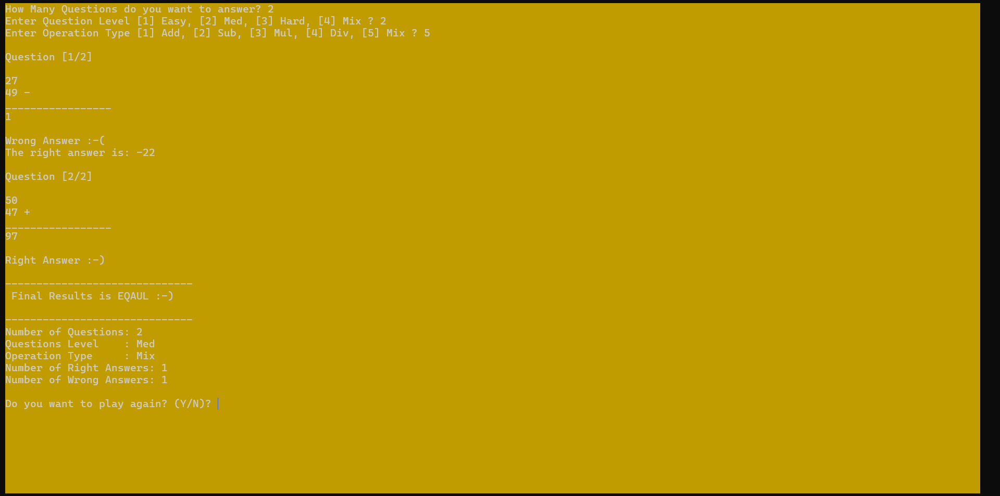
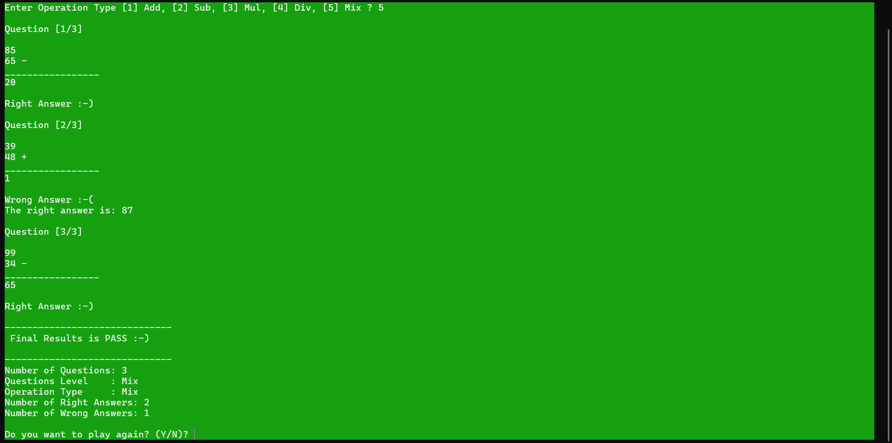

# Math Game — A Console-Based Arithmetic Game
## 🎮 Description
**Math Game** is a simple C++ console game for practicing arithmetic with random questions and instant feedback. Players choose difficulty levels and operations, then solve math problems generated on the fly.

---

---
## ✨ Features
- Multiple difficulty levels: Easy, Medium, Hard, and Mixed
- Operation types: Addition, Subtraction, Multiplication, Division, or Mixed
- Randomly generated math problems
- Real-time feedback (correct or incorrect) with writing the correct answer
- Final result screen with performance summary
- Option to replay the game

---
- **Language:** C++
---

## 📸 Sample Gameplay

---

